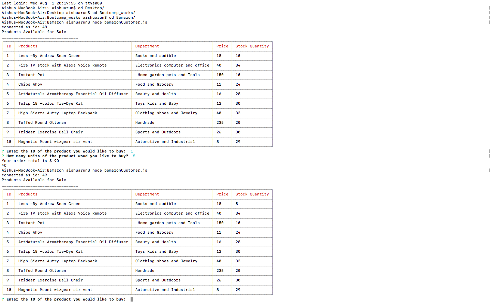

# Bamazon

Bamazon is a Node.js and MySQL Amazon-like application. 

The bamazoncustomer.js lists the products available with the id, department, price and stock available. 

It prompts customers with which product they would like to buy and the quantity of the item they would like to buy. Also it calculates the final total of the order. 

